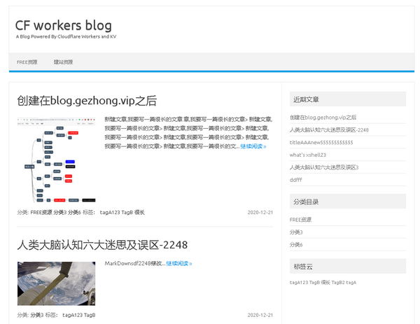
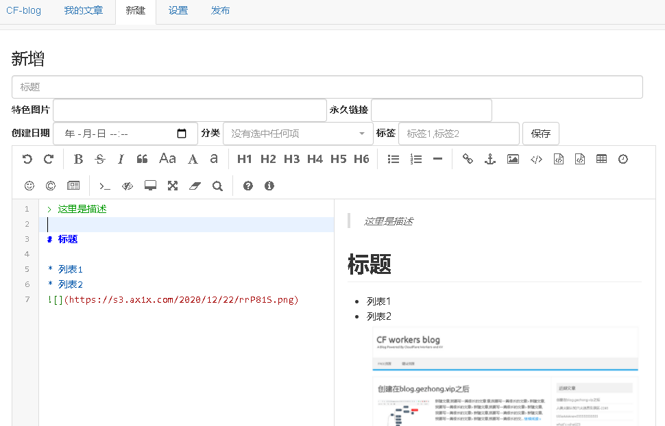

本项目**Tinger Blog**是由基于[gdtool/cloudflare-workers-blog](https://github.com/gdtool/cloudflare-workers-blog)、[https://github.com/Arronlong/cfblog-plus](https://github.com/Arronlong/cfblog-plus)二次开发而来，主要是对cf worker中的js进行自主开源，并扩展了许多功能。

## 与CF-Blog相比，有哪些变更：

1. 开源部署在workers中的js，根据自己的理解，进行自主开发并开源，详见[workers.js](workers.js)
2. 扩展md编辑器配置，可以自行根据需要修改配置。目前可配置支持html标签解析（默认关闭），更多设置参考[editormd官网](https://pandao.github.io/editor.md/)
3. 后台新建页和编辑页，自动设置时间和默认图片(使用JustNews主题时必须设置，否则样式大变)，默认图片为：
4. 添加文章置顶设置功能
5. 添加后台首页选择功能
6. 添加文章隐藏功能
7. 静态搜索
8. 修复`DOMNodeInserted`、`DOMSubtreeModified`弃用bug
9. 统一HTML的`jsdelivr`分发

一些功能还在规划中：

1. 文章独立密码

---

> 这是一个运行在cloudflare workers 上的博客程序,使用 cloudflare KV作为数据库,无其他依赖.
兼容静态博客的速度,以及动态博客的灵活性,方便搭建不折腾

# 主要特点
* 使用workers提供的KV作为数据库
* 使用cloudflare缓存html来降低KV的读写
* 所有html页面均为缓存,可达到静态博客的速度
* 使用KV作为数据库,可达到wordpress的灵活性
* 后台使用markdown语法,方便快捷
* 一键发布(页面重构+缓存清理)

# 承载能力

 * KV基本不存在瓶颈,因为使用了缓存,读写很少
 * 唯一瓶颈是 workers的日访问量10w,大约能承受2万IP /日
 * 文章数:1G存储空间,几万篇问题不大

# 原作者更新日志

### 前端演示:

### 后端演示:
